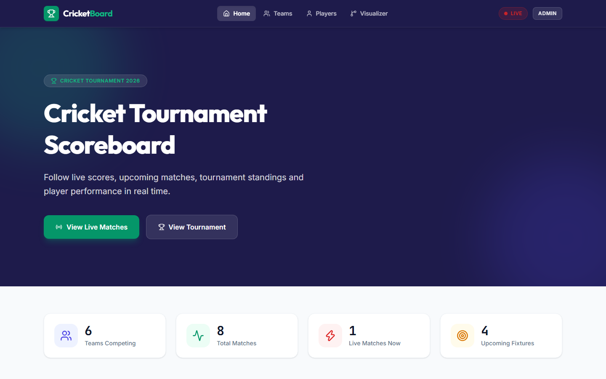
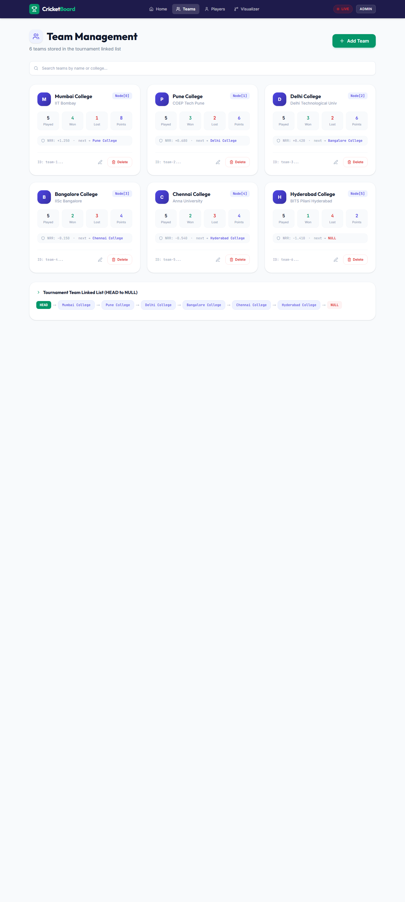
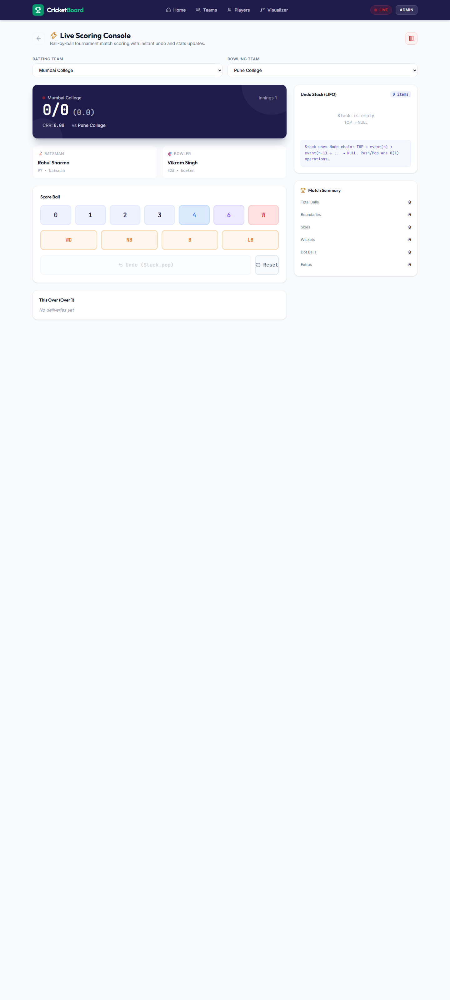
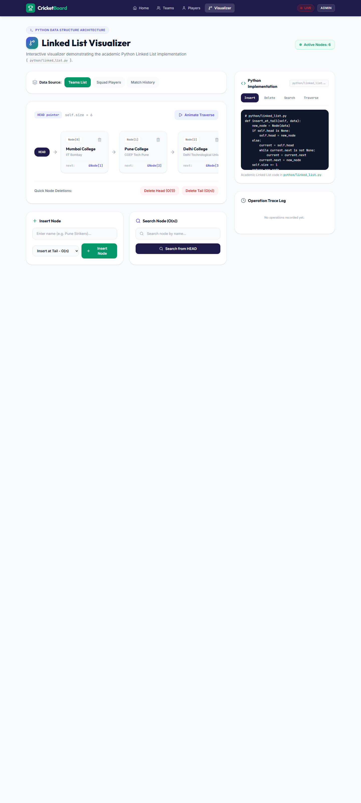
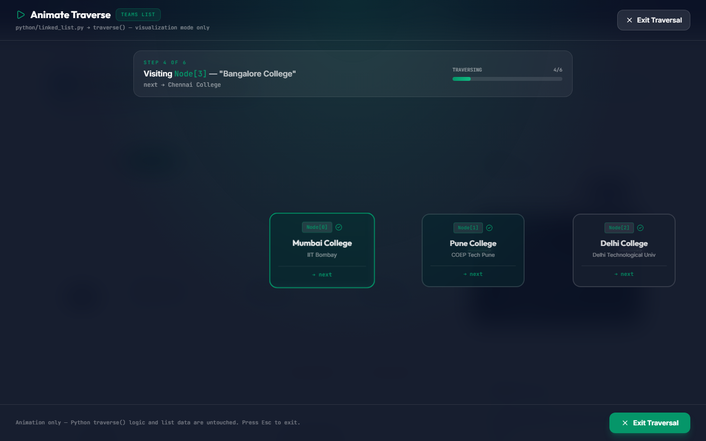
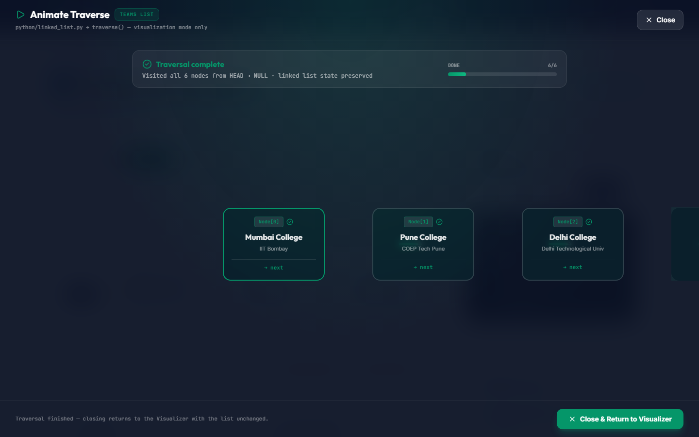
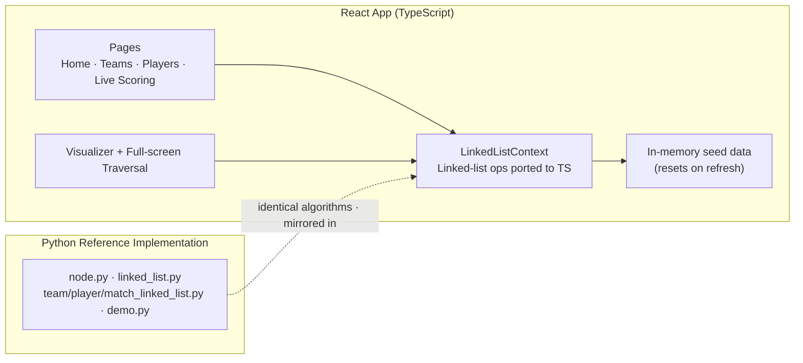

# 🏏 CricketBoard

**College Cricket Tournament Scoreboard & Management System — built on a custom Singly Linked List.**

A web application for managing college cricket tournaments — teams, squads, fixtures, and ball-by-ball live scoring — where every piece of domain data is modeled with a **singly linked list implemented from scratch** (no built-in list shortcuts). The project ships with a **Python reference implementation** of the data structure and an interactive **browser visualizer** that animates insert, delete, search, and traversal operations node-by-node with their time complexities.


---

## ✨ Features

| Module | What it does |
|---|---|
| 🏠 **Home Dashboard** | Tournament overview — teams, total/live/upcoming matches, hero CTA |
| 👥 **Team Management** | Add / delete college teams, points table sorted by points, net run rate |
| 🏏 **Player Management** | Squad per team — roles, jersey numbers, batting/bowling stats |
| ⚡ **Live Scoring Console** | Ball-by-ball scoring — runs, extras, wickets, undo (stack-based), live scorecard |
| 🔗 **Linked List Visualizer** | The academic core — see the actual list behind the UI |

### Linked List Visualizer highlights

- **Switch data source** — visualize the *Teams*, *Players*, or *Matches* list
- **Insert at Head — O(1)** / **Insert at Tail — O(n)** with live node animation
- **Delete** any node (Delete Head O(1), Delete Tail O(n), per-node delete)
- **Search from HEAD — O(n)** with highlight + traversal counter
- **🔍 Full-screen Animate Traverse** — a dedicated overlay that walks **HEAD → NULL** one node at a time, keeps the active node centered, shows step N of N + next-pointer info + progress bar, and returns to the normal page with the list untouched
- **Operation Trace Log** — every action logs the equivalent Python call, e.g. `[Python insert_at_head()] "X" inserted at HEAD — becomes new first node`
- **Python Implementation panel** — displays the actual `python/linked_list.py` source next to the UI so the mapping is auditable

---

## 📸 Screenshots

| Home | Teams |
|---|---|
|  |  |

| Live Scoring | Visualizer |
|---|---|
|  |  |

| Full-screen traversal (mid) | Full-screen traversal (complete) |
|---|---|
|  |  |

---

## 🧠 Academic Core — why linked lists?

Every domain collection (teams, players, matches, live-ball history/undo) is modeled as a singly linked list with explicit **head** and **next** pointer manipulation.

| Operation | Time | Pointer logic |
|---|---|---|
| Insert at head | **O(1)** | `new_node.next = self.head; self.head = new_node` |
| Insert at tail | **O(n)** | traverse to last node, then link |
| Insert at index | **O(n)** | walk to predecessor, re-link |
| Search by value | **O(n)** | walk from HEAD, early exit |
| Delete by value | **O(n)** | locate `prev`, then `prev.next = target.next` |
| Traverse | **O(n)** | HEAD → … → NULL |

The live scoring **undo** uses a **stack** (LIFO) — the last ball bowled is the first undone.

---

## 🏗️ Architecture



**Two layers, one algorithm:**

1. **`python/`** — the reference implementation (academic deliverable). Runs standalone via `python demo.py`.
2. **`src/`** — the same algorithms ported to TypeScript so they execute in the browser (browsers cannot run Python). The Visualizer displays the Python source and mirrors its log messages line-for-line.

> **Data layer:** currently in-memory (React context + seed data). A real database is listed under future scope.

---

## 🐍 Python Reference Implementation

| File | Purpose |
|---|---|
| `python/node.py` | `Node` — `data` + `next` pointer |
| `python/linked_list.py` | Generic singly linked list — insert head/tail/index, delete, search, traverse, `to_list`, `get_nodes` |
| `python/team_linked_list.py` | `Team` + `TeamLinkedList` |
| `python/player_linked_list.py` | `Player` + `PlayerLinkedList` |
| `python/match_linked_list.py` | `Match` + `MatchLinkedList` |
| `python/demo.py` | Step-by-step viva/demo script printing every operation |

```bash
cd python
python demo.py
```

---

## 🚀 Getting Started

**Prerequisites:** Node.js 18+ · npm · Python 3.10+ (optional, for the reference demo)

```bash
# 1. Clone
git clone <your-repo-url>.git
cd "cricket scoreboard"

# 2. Install dependencies
npm install

# 3. Start dev server
npm run dev
# → open http://localhost:5173
```

**Production build:**

```bash
npm run build     # type-check (tsc) + bundle to dist/
npm run preview   # serve the production build
```

---

## 📁 Project Structure

```
cricket-scoreboard/
├── python/                     # Python reference implementation (academic core)
│   ├── node.py
│   ├── linked_list.py
│   ├── team_linked_list.py
│   ├── player_linked_list.py
│   ├── match_linked_list.py
│   └── demo.py
├── docs/                       # Screenshots used in this README
├── public/
│   └── favicon.svg
├── src/
│   ├── App.tsx                 # Routes: /, /admin/teams, /admin/players,
│   │                           #        /admin/scoring/:matchId, /admin/visualizer
│   ├── index.css               # Tailwind v4 + design system (@layer components)
│   ├── components/layout/      # Navbar, Footer
│   ├── context/
│   │   └── LinkedListContext.tsx   # State + TS linked-list operations
│   ├── data/seedData.ts        # Initial tournament data
│   ├── pages/
│   │   ├── public/HomePage.tsx
│   │   └── admin/              # Teams, Players, LiveScoring, LinkedListVisualizer
│   └── types/index.ts
├── index.html
├── package.json
├── tsconfig.json
└── vite.config.ts
```

---

## 🔭 Future Scope

- **Database persistence** — Supabase/PostgreSQL behind the existing context layer
- **Auth** — admin login for scoring & management pages
- **More visualizations** — stack, queue, binary tree, and graph animators
- **Automated tests** — unit tests for every linked-list operation
- **PWA / offline** — installable mobile experience

---

## 📜 Academic Note

Built as a **capstone project** for the data-structures curriculum. The Python files in `python/` are the syllabus-aligned reference implementation (custom `Node`, explicit pointer manipulation, documented complexity) — no built-in list structures are used for the core operations. The web app ports the identical logic to TypeScript and visualizes it, so every operation's behavior and cost can be observed live.

---

<p align="center">Made with ❤️ for college cricket + data structures</p>

